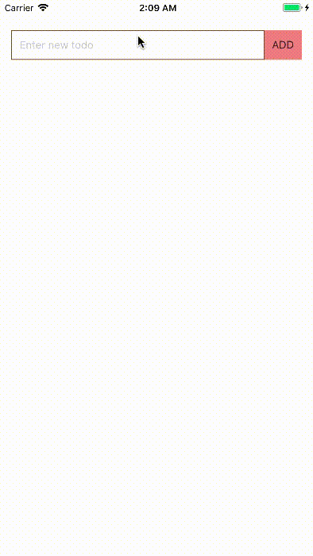

## Simple todo app in vue-native



### Installation step
• ```git clone git@github.com:ankitsinghania94/vue-native-todo-app.git```.<br />
• Navigate to project directory and do ```npm install```.<br />
• ```npm start``` to run the project.<br />
Similiarly you can do ```npm run ios``` for building in simulator.
